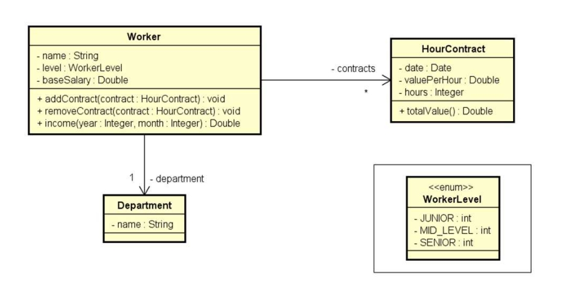

# Exercicio de Fixação - Worker Contracts

Este projeto é uma aplicação de console em C# que simula o cadastro de trabalhadores com contratos por hora. 
O objetivo é calcular o salário de um trabalhador em um determinado mês, somando o salário base com os valores dos contratos realizados no período.

## 📚 Objetivo

Ler os dados de um trabalhador com N contratos e, em seguida, informar o mês e ano para calcular quanto esse trabalhador recebeu naquele período.



## 💡 Exemplo de uso

```bash
Enter department's name: Design
Enter worker data:
Name: Alex
Level (Junior/MidLevel/Senior): MidLevel
Base salary: 1200.00
How many contracts to this worker? 3
Enter #1 contract data:
Date (DD/MM/YYYY): 20/08/2018
Value per hour: 50.00
Duration (hours): 20
Enter #2 contract data:
Date (DD/MM/YYYY): 13/06/2018
Value per hour: 30.00
Duration (hours): 18
Enter #3 contract data:
Date (DD/MM/YYYY): 25/08/2018
Value per hour: 80.00
Duration (hours): 10

Enter month and year to calculate income (MM/YYYY): 08/2018
Name: Alex
Department: Design
Income for 08/2018: 3000.00
